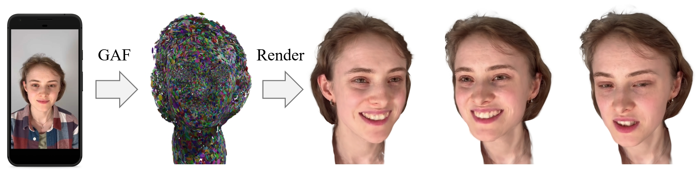

# GAF
**GAF: Gaussian Avatar Reconstruction from Monocular Videos via Multi-view Diffusion**

[**arXiv**](https://arxiv.org/abs/2412.10209)  | [**Video**](https://youtu.be/QuIYTljvhyg) | [**Project Page**](https://tangjiapeng.github.io/projects/GAF/)  

</div
- Given a short, monocular video captured by a commodity device such as a smartphone, GAF reconstructs a 3D Gaussian head avatar, which can be re-animated and rendered into photo-realistic novel views. 
Our key idea is to distill the reconstruction constraints from a multi-view head diffusion model  in order to extrapolate to unobserved views and expressions.

## Source Code Coming Soon!